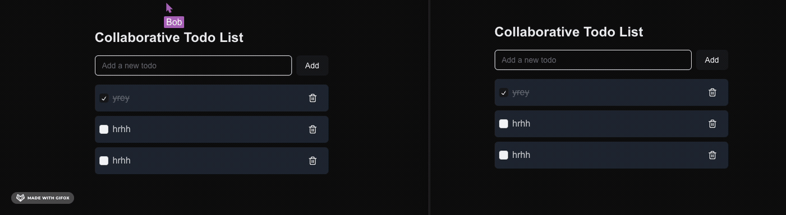

# Todo Demos

Yjs demo collections, including todo app, whiteboard, text editor and more

## Demo



👉 You can also try it out [here](https://yjs-demo-pi.vercel.app/)

## Prerequisites

- Node.js (v14 or later)
- pnpm

## Installation

 Clone the repository:
   ```sh
   git clone git@github.com:chenxiaoyao6228/yjs-demo.git
   cd yjs-demo
   ```

Install dependencies:
   ```sh
   pnpm install
   ```

   
## Development

### Running the Collaborative Server

Start the collaborative server:

   ```sh
   pnpm run collab-server   
   ```

### Running the Development Server

Start the development server:
```sh
pnpm run dev
```

Open your browser and navigate to `http://localhost:3000` to access the Todo application.


## About

This project is generated with cursor AI